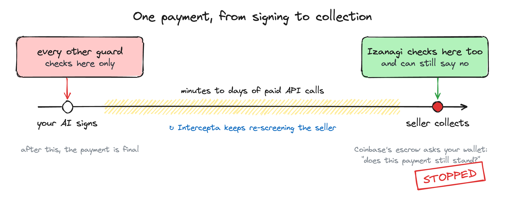
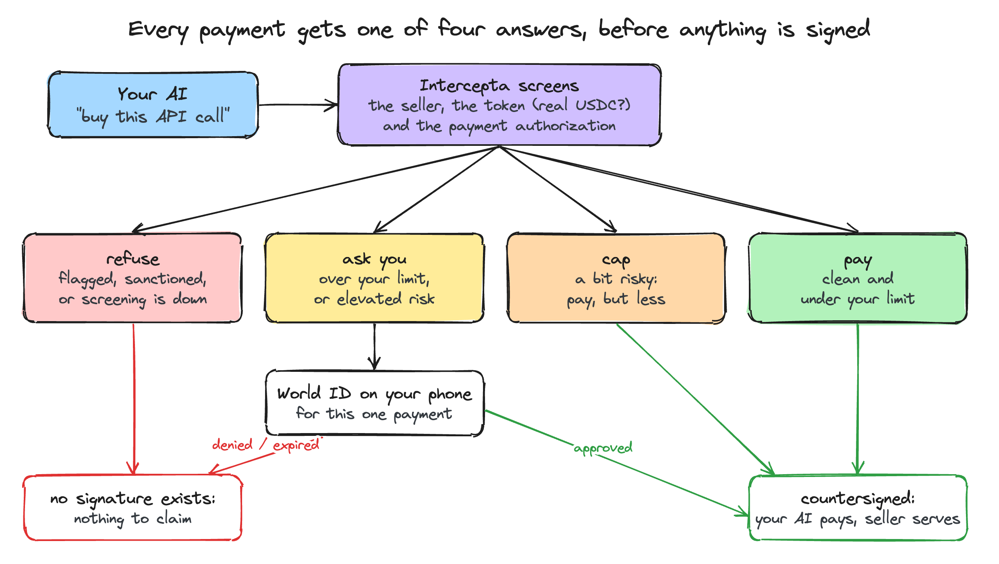
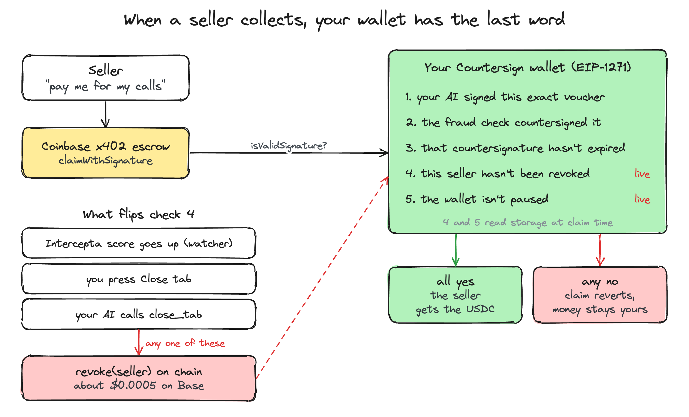
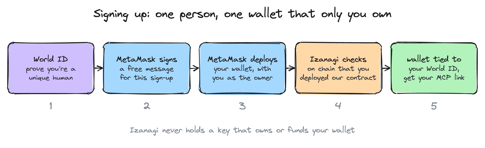
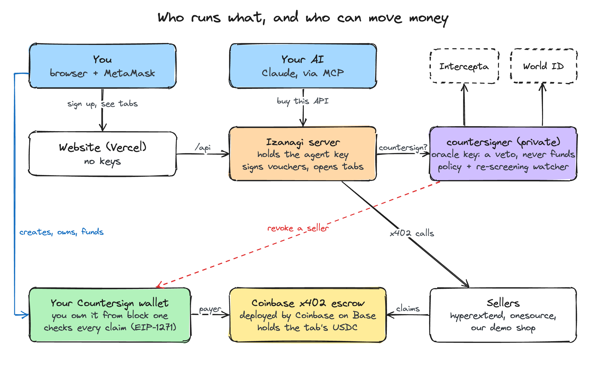

# Izanagi

**A wallet for AI agents where a payment can still be stopped *after* it has been made.**

<!-- TODO: replace YOUR_VIDEO_ID with the YouTube link to the demo -->
**▶ [Watch the demo video](https://youtu.be/YOUR_VIDEO_ID)** · **[Try it live](https://izanagi-black.vercel.app)**

Every agent-payment guard today checks *before* the agent signs, because with `exact`/EIP-3009
signing **is** spending. Izanagi runs on x402's `batch-settlement` scheme instead: the agent signs
vouchers as it goes, the seller cashes them in later, and Coinbase's escrow asks **our wallet**
*"is this still valid?"* at that moment. A seller that turns bad after being paid still gets nothing.



How long that window stays open is the seller's choice: busy sellers on Base cash in every
1–5 minutes, quiet ones go days without claiming.

## Try it live

Everything runs on **Base mainnet** with real USDC, against Coinbase's deployed escrow.

| | |
|---|---|
| Website | **[izanagi-black.vercel.app](https://izanagi-black.vercel.app)** |
| Demo shop (goes rogue after 3 calls) | [`seller-production-18f0.up.railway.app/v1/data`](https://seller-production-18f0.up.railway.app/v1/data) |
| Backend health | [`tab-production-5655.up.railway.app/api/health`](https://tab-production-5655.up.railway.app/api/health) |

1. **Sign up** with World ID (the event's sandbox), then create your own wallet from MetaMask.
2. **Add money**: a few USDC on Base, from MetaMask.
3. **Connect your AI**: add your personal MCP link to Claude, then ask *"Use Izanagi to get the
   latest Bitcoin price from hyperextend."*
4. **Watch it stop**: buy from the demo shop until it turns rogue, then **Close tab**. The shop
   can no longer collect for calls it already served.

---

## How it works

### 1. Before paying: four possible answers



The verdict isn't advice the agent may ignore: without the countersignature, **no claimable
voucher exists**. No Intercepta key, or Intercepta down, means every payment is refused.

### 2. When the seller collects: your wallet decides



The channel's `payer` is your Countersign wallet and its `payerAuthorizer` is `address(0)`, so
Coinbase's escrow checks **every voucher** through `isValidSignature` on our contract. Checks 4
and 5 read live storage at claim time. That is the whole idea, and a pre-signing guard can't do it.

<details>
<summary>Trust model: the oracle key holds a veto, never the funds</summary>

|  | agent key | oracle key | both | neither (timeout) |
|---|---|---|---|---|
| Move money | ✗ | ✗ | ✓ | ✗ |
| Redirect to another seller | ✗ | ✗ | ✓ | ✗ |
| Block a payment | ✗ | ✓ | ✓ | — |
| **Recover funds** | ✗ | ✗ | ✓ | ✓ after the withdraw delay |

If the oracle disappears forever, the owner still recovers the escrow alone via
`initiateWithdraw`/`finalizeWithdraw` after the channel's `withdrawDelay` (15 minutes minimum, a
day for the real sellers we paid). Verified in the tests.

</details>

### 3. Signing up: your wallet, your keys



The server only accepts a deployment sent by the account that signed the sign-up message, of
exactly our contract wired to our agent, oracle and collector. So nobody can claim a wallet
somebody else created.

<details>
<summary>Why tabs never leave a standing allowance</summary>

The agent opens tabs through the wallet's own `openTab`, which approves the deposit collector for
exactly that deposit and resets it to zero. The collector only moves funds into a channel the
wallet gates (`payerAuthorizer == 0`). Without that check, anyone could open a channel funded by a
standing allowance, name themselves its authorizer and claim it. We found that on a fork of the
real escrow, and [`TabFlow.t.sol`](contracts/test/TabFlow.t.sol) keeps it closed.

</details>

---

## Architecture



<details>
<summary>Every piece, where it runs, and whether it can move your money</summary>

| Piece | Runs on | Holds | Can it move your money? |
|---|---|---|---|
| Your Countersign wallet | Base | nothing: your MetaMask owns it from the block that created it | only with both signatures, or when you withdraw |
| Website (`tab/ui`) | Vercel | no keys | no |
| Izanagi server (`tab`) | Railway | the agent key | no: every voucher also needs the oracle |
| `countersigner` | Railway, private | the oracle key, Intercepta and World secrets | no: it can only refuse, or revoke |
| `seller` (demo shop) | Railway | its claim key | only cashes in vouchers your wallet accepts |
| Deposit collector | Base | no keys | only into a tab your own wallet gates |

The funds sit in **Coinbase's deployed `x402BatchSettlement` escrow**
(`0x4020074e9dF2ce1deE5A9C1b5c3f541D02a10003`, live on Base, Optimism and Arbitrum). We did not
write that contract, which is exactly why the guarantee is credible.

</details>

---

## Sponsor integrations

### Intercepta: screening *is* the signature

Three endpoints, each used where it belongs. The four verdicts are exactly the brief's *"pay,
refuse, cap the amount or ask a human"*: [`policy.rs`](countersigner/src/policy.rs) → `Verdict`.

| What | Endpoint | Code |
|---|---|---|
| Counterparty (`payTo`) | `GET /account/{addr}/quick-scan` | [`intercepta.rs`](common/src/intercepta.rs) → `scan_address` |
| Token (real USDC vs lookalike) | `GET /token-intelligence/token/{addr}/risks` | `scan_token` |
| The payment authorization itself | `POST /analysis/signature` | `scan_message` |
| The payer, on the seller's side | `GET /account/{addr}/quick-scan` | [`seller/src/screen.rs`](seller/src/screen.rs) |

- **The score keeps mattering after signing.** The [re-screening loop](countersigner/src/state.rs)
  polls every open tab; when a score crosses the threshold it revokes the seller, killing vouchers
  that were already signed.
- **No mock mode.** Without a key, both sides fail closed.

<details>
<summary>The paid side: the seller screens its payer and sets a credit line</summary>

A `batch-settlement` seller serves first and is paid later, so every request extends credit. The
[demo seller](seller/src/screen.rs) turns the payer's score into a credit line:

| Payer toxicScore | Served? | Unclaimed value carried |
|---|---|---|
| below `PAYER_CAREFUL_AT` (30) | yes | up to `CLAIM_MAX_UNCLAIMED` (1 USDC) |
| below `PAYER_REFUSE_AT` (60) | yes | none: claimed after every request |
| at or above | **no** (403) | — |

It also asks the payer's wallet the same `isValidSignature` question before serving, so it sees
a revocation from its side too:

```
CLAIM REJECTED by the escrow: 0.020000 USDC we served for is unclaimable.
the payer's Countersign wallet revoked this seller at 1790424567 (reason: wallet_drainer)
- after we had served the requests
```

</details>

#### My feedback on the Intercepta API

- **Time to first call:** a bit over an hour.
- **What confused me:** the product is called Intercepta, but the docs and the API live under
  web3antivirus (`docs.web3antivirus.io`, `api.web3antivirus.io`), and every path has
  `/extension/` in it. At first I wasn't sure I was even in the right place. The 403 you get with a
  bad key helped, because it let me check the paths were real before my key worked.
- **Also confusing:** `/analysis/signature` gave me a Low score when I sent the message as a string.
  It only scores it properly as a JSON object, and nothing tells you that. I'd rather get an error.
- **What was missing:** a way to get told when a score changes. I re-screen every open tab in a
  loop, so I have to keep polling. A webhook for the addresses I'm watching would let me stop a
  seller the moment it goes bad. A batch endpoint would help too, so one round isn't N calls.
- **Small thing:** the data is mainnet only. Fine for me since I run on Base mainnet, but a clear
  "network not covered" answer would save testnet teams from getting it wrong.

### World: the human gate

When the verdict is `ask`, no signature exists until a real person approves on their phone.
Full sequence and every unsuccessful path: **[docs/world-flow.md](docs/world-flow.md)**.

- **Device Authorization Grant (RFC 8628)** on World's OIDC provider, via the official
  [`openidconnect`](https://crates.io/crates/openidconnect) crate: the headless agent shows a
  short code, the person approves in World App.
- **One approval authorises one payment.** It's bound to the voucher digest, so it can't be moved
  to another seller, another amount, or a second payment.
- **The limit belongs to the person.** Keyed by the pairwise `sub`: one human with three agents
  shares one limit.
- **Five denied paths** (`access_denied`, `expired_token`, `cancelled`, `stale_authentication`,
  `insufficient_assurance`) each produce no countersignature, so **the on-chain claim reverts**.
- **Backend-only validation.** The `id_token` is verified against World's JWKS; the client secret
  never leaves the countersigner, and the agent never sees the `device_code` or the subject.

<details>
<summary>Freshness and assurance details</summary>

World's OIDC guide says the device grant accepts `scope=openid` only (`nonce`, `max_age`,
`prompt` and `acr_values` are ignored) because *"fresh proof is already required"*. So we send
none of them and add an `auth_time` check (300s) as a second belt. `acr` is enforced against the
Orb credential when the IdP asserts one; an absent claim isn't a failure, because the grant
itself guarantees the proof. Live discovery advertises:

```
device_authorization_endpoint  .../api/v1/device_authorization
grant_types_supported          [authorization_code, urn:ietf:params:oauth:grant-type:device_code]
subject_types_supported        [pairwise]
acr_values_supported           [https://world.org/oidc/acr/orb-v3]
```

</details>

#### My integration debrief: World ID for Agents

- **Time to first success:** about 1-2 hours to the first approval checked on my backend (phone
  code on the event sandbox, `id_token` checked against World's keys).
- **Friction:** the phone-code flow (device grant) is exactly what a headless agent needs, but it's
  only on the sandbox. Production `id.worldcoin.org` doesn't have it, only the normal login flows.
  So to go live I'd have to send people a login link instead of a short code.
- **Missing docs:** I couldn't find whether the device-flow `id_token` always has `acr`, so I only
  check for Orb when it's there. I also didn't find any example of tying an approval to one
  specific action, like one payment. I tie it to the payment's hash myself.
- **One improvement that would help most:** put the device flow in production, and let me send a
  short line like "you're approving $0.05 to hyperextend" that shows up in World App. Then people
  see what they're approving on World's own screen, not only on mine.

---

## Validation

All tests run against the **real deployed escrow on real mainnet forks** with real USDC.

```
contracts:  40 passed, 0 failed     (Base, Optimism, Arbitrum forks)
rust:      137 passed, 0 failed
seller e2e:  1 passed, 0 failed     (Base fork, real escrow, over HTTP)
tab e2e:     1 passed, 0 failed     (Base fork: your account creates the wallet → tabs → every cent back)
mainnet:     Izanagi's own code on Base, real USDC, a real seller (below)
```

**On Base mainnet, through Izanagi's own code** ([`mainnet_wallet.rs`](tab/tests/mainnet_wallet.rs), Sep 27, 2026):

| Step | Transaction |
|---|---|
| A person's own account creates their wallet ([`0x4881…601b`](https://basescan.org/address/0x48818697fc650875dae7442648e0891fabe8601b)), and Izanagi's check accepts it | [`0x7814…b85e`](https://basescan.org/tx/0x78145568835bdcd08fc8006b74839218ea29f8adda6be3eb10b399a20cc85b8e) |
| They add 0.02 USDC | [`0xdffa…5d28`](https://basescan.org/tx/0xdffaf3cb427fbd4ebf639837c4fdeb918cdcd7974e2bb0e431cc28f5c0935d28) |
| Izanagi buys a real BTC candle from hyperextend: screened by Intercepta, countersigned, the tab opened through `openTab`, no allowance left | [`0xc2b0…a86d`](https://basescan.org/tx/0xc2b0aa6554de6e294c57b18c1fe1882de4a30a78faeecca40693bab5737ba86d) |
| Closing the tab revokes hyperextend on the wallet | [`0x3103…1994`](https://basescan.org/tx/0x310343a3cc51ceb658faf8172739b59fcdbee605d011477b300d9aba4dba1994) |

hyperextend served the data and holds a signed voucher for it, but claimed nothing before the
revocation, so now it never can: the tab's whole 0.005 USDC goes back to its owner.

Earlier, a Countersign wallet (`0x81E0FAC8aA64cE0E95Ec43337568c0744aB0C70b`) paid two
third-party sellers on mainnet, hyperextend (BTC candles, 0.002 USDC) and onesource (Ethereum
block number, 0.001 USDC). **Neither seller changed anything to accept an EIP-1271 payer.**

<details>
<summary>What the tests cover</summary>

happy path · agent-key compromise · wrong oracle key · missing oracle signature · expired
attestation · attestation bound to a different seller · replay · over-ceiling · over-balance ·
revocation before signing · **revocation after signing** · un-revoke · agent cannot revoke ·
agent cannot withdraw · oracle cannot withdraw · owner recovery with the oracle absent · direct
claim by the seller · claim-before-revoke is final · a stranger routing the wallet's allowance
into a channel they authorise · the agent opening an ungated or long-locked channel · no
allowance left standing after a tab · a wallet that works from the transaction creating it · a
stranger claiming someone else's new wallet · a wallet wired to other keys passed off as ours ·
ownership moving only when its owner moves it.

- **Seller end to end** ([`server.rs`](seller/src/server.rs) → `fork_serve_revoke_reject_restore_claim`):
  serves two paid requests, gets a corrective 402, refuses a voucher with no countersignature;
  the owner revokes, the claim is **rejected by Coinbase's escrow**; after a restore it settles.
- **Cross-language parity**: Rust countersigner signatures are accepted by the deployed escrow
  and become unclaimable once revoked ([`RustParity.t.sol`](contracts/test/RustParity.t.sol)).
- **Real sellers on a fork**: [`RealSeller.t.sol`](contracts/test/RealSeller.t.sol) replays
  hyperextend and onesource with their live channel terms, including a revocation after signing.
- **Real deployment path**: deployed through the canonical CREATE2 deployer, not cheatcodes.
- The mainnet run found two bugs, both fixed: a rate-limited RPC used to cancel a revocation
  (every service now retries with backoff), and the escrow counts the withdraw delay from when a
  withdrawal starts.

</details>

### Measured numbers

| | |
|---|---|
| `claimWithSignature` through EIP-1271 | **164,645 gas** (~$0.0027 on Base) |
| `revoke`, the kill switch | ~30,000 gas (~$0.0005) |
| Whole demo, on mainnet | **~$0.0065** |
| Channels ever opened on the escrow (Sep 26) | **1,724**, from 201 payers to 75 sellers |
| How often active sellers cash in | every **1–5 minutes** (median); hyperextend and onesource: not once in 7 days |
| Payers that are a policy contract, before Izanagi | **none** |

---

## Running it

On a local fork of Base, against the real escrow and real USDC:

```bash
anvil --fork-url https://mainnet.base.org             # terminal 1
source <(scripts/fork-setup.sh)                        # deploys Countersign, opens a 20 USDC channel
export INTERCEPTA_API_KEY=...                          # both sides screen; without it both refuse

cargo run -p countersigner --bin countersigner         # terminal 2 (+ WORLD_CLIENT_ID/SECRET for `ask`)
SELLER_ADMIN_TOKEN=demo cargo run -p seller            # terminal 3
cargo run -p agent -- fetch http://127.0.0.1:8080/v1/data 3

# the moment: revoke the seller after it has been paid, then watch its claim fail
cast send $COUNTERSIGN_WALLET 'revoke(address,uint32)' $SELLER_RECEIVER 4 --private-key $OWNER_KEY
curl -X POST -H 'Authorization: Bearer demo' http://127.0.0.1:8080/admin/claim
```

Tests:

```bash
cargo test --workspace                                        # unit + HTTP tests, no chain
source <(scripts/fork-setup.sh) && cargo test -p seller -- --ignored   # seller e2e on the fork
export BASE_RPC=https://mainnet.base.org && (cd contracts && forge test)
```

Every scenario step by step, including a blocked payment: **[docs/testing.md](docs/testing.md)**.
Deploying (Railway + Vercel, Base mainnet): **[docs/deploy.md](docs/deploy.md)**.

<details>
<summary>Layout and configuration</summary>

```
contracts/      Countersign.sol — EIP-1271 payer + settlement-time revocation registry
common/         EIP-712 types byte-identical to the escrow, x402 v2 wire types,
                escrow bindings, the Intercepta client, shared utils
countersigner/  the brain: World OIDC, policy, budgets, the signing key, the watcher
agent/          demo agent: profiles the Bazaar, pays x402 sellers through the countersigner
seller/         x402 batch-settlement seller: screens payers, verifies vouchers via
                EIP-1271, cashes them in through the escrow
scripts/        fork-setup.sh, mainnet-setup.sh, railway-setup.sh
tab/            the Izanagi server: API, MCP endpoint, sign-up, the tabs each person's AI opens
tab/ui/         the website (Vercel): sign-up, dashboard, World ID approvals, MetaMask
docs/diagrams/  the diagrams in this README
```

The seller and agent speak x402 v2 as specified in
[`scheme_batch_settlement_evm.md`](https://github.com/x402-foundation/x402/blob/main/specs/schemes/batch-settlement/scheme_batch_settlement_evm.md):
terms in `PAYMENT-REQUIRED`, cumulative vouchers in `PAYMENT-SIGNATURE`, receipts in
`PAYMENT-RESPONSE`, and the spec's error codes, including the corrective 402.

Every crate reads its environment in one file, `src/env.rs`, and ships its own `.env.example`;
there is no root-level env file. A missing key names itself at startup, and config structs
holding secrets redact them in `Debug`.

| File | Holds |
|---|---|
| [`countersigner/.env.example`](countersigner/.env.example) | every secret and every threshold |
| [`agent/.env.example`](agent/.env.example) | one key, and no authority |
| [`seller/.env.example`](seller/.env.example) | the x402 endpoint, its payer thresholds and claim policy |
| [`tab/.env.example`](tab/.env.example) | the agent key, where the countersigner and the website are |
| [`scripts/.env.example`](scripts/.env.example) | your own keys for the setup scripts, and the production deploy's addresses |

</details>

## Known limitations

1. **Revocation binds only before the claim lands.** A successful `claimWithSignature` is final
   (`test_D_Limitation_ClaimBeforeRevokeIsFinal`).
2. **No API calls inside `isValidSignature`.** It's a static call, so every verdict is pre-baked
   into a signature or a pre-flipped storage bit.
3. **Stock sellers don't expect vouchers to expire.** Our demo seller claims before the
   attestation lapses; for real sellers that go a week without claiming, mainnet sets
   `ATTESTATION_TTL` to 30 days and revocation is the brake.
4. **The oracle can grief by refusing to sign.** Bounded: the owner recovers alone after
   `withdrawDelay`.
5. **The phone-code World ID flow is sandbox-only.** Production would send a login link
   (authorization code + PKCE) instead.
6. **One operator runs both signing keys.** Separate custody and an on-contract spending limit
   are the fixes before real money at scale.

## License

MIT
